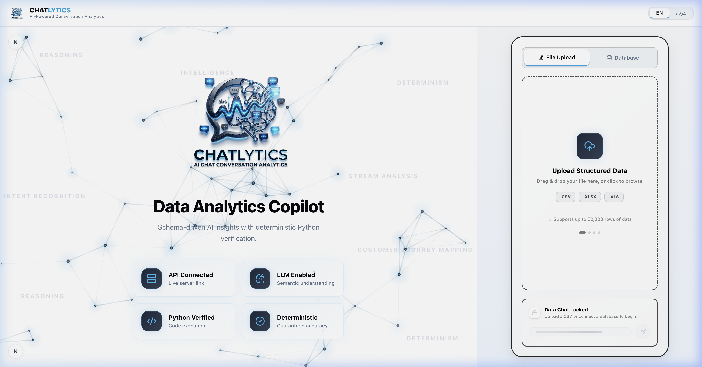
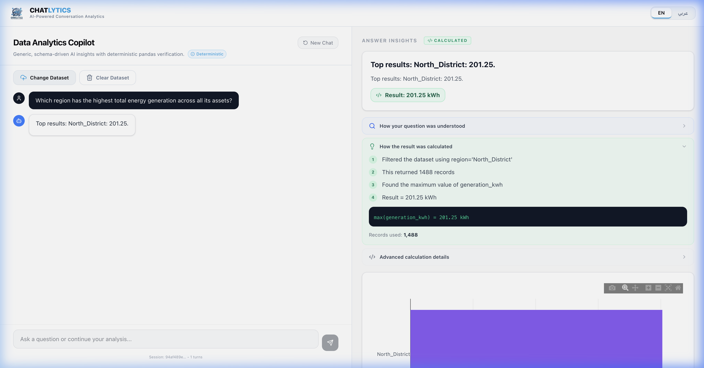
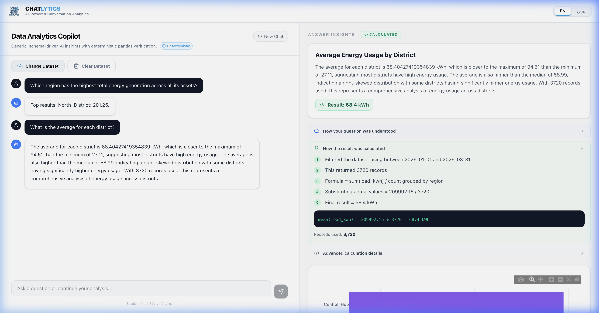
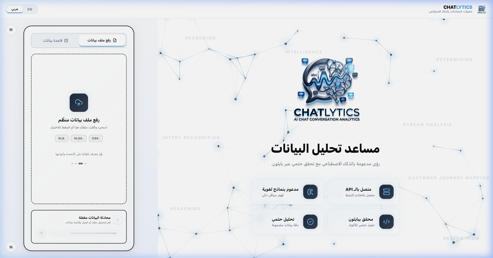
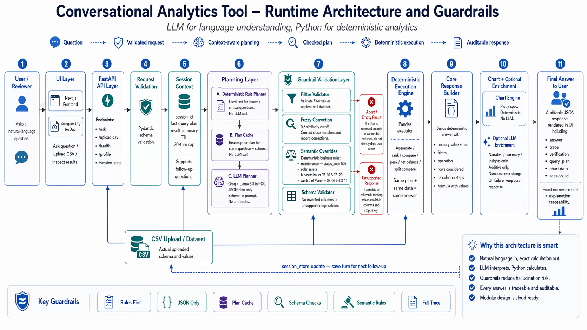

# Chatlytics

**AI-Powered Conversational Analytics Copilot** — Ask analytics questions in natural language; the backend converts them into structured query plans, executes calculations deterministically with pandas, and returns traceable JSON responses with charts and narrative summaries.



_Schema-driven AI Insights with deterministic Python verification._

## ✨ Key Features

- **🧠 LLM for planning, Python for math.** The LLM maps natural language to a JSON query plan; pandas performs the actual filters, aggregations, comparisons, and rankings — no hallucinated numbers.
- **🔍 Traceable answers.** Every response includes the operation, filters, columns used, and rows considered so a reviewer can see how the answer was derived.
- **📊 Smart Data Profiling.** Uploaded datasets are automatically profiled with quality metrics, distribution analysis, correlations, anomaly detection, and AI-generated insights.
- **🗄️ Multiple Data Sources.** File upload (CSV, XLSX, XLS) and secure database connections (MySQL, PostgreSQL, Oracle, MongoDB, DuckDB, and more).
- **🌍 Full Bilingual RTL Support.** English / Arabic toggle with complete right-to-left layout, including flipped panels, icons, and text alignment.
- **🎨 Premium UI.** Black & Electric Blue design system with 3D floating logo, animated network background, metallic gradient badges, and micro-animations.
- **💬 Conversational Memory.** Multi-turn follow-up questions with session context tracking.

---

## 🔍 Traceable & Deterministic Calculations

Every answer shows **exactly how it was computed** — no black boxes. The Insight Panel reveals the full calculation trace so you can verify every step:



**What you see in the Insight Panel (right side):**

| Section | What It Shows |
|---------|---------------|
| **🏷️ Answer Insights** | AI-enriched narrative explaining the result with statistical context (mean, median, distribution shape) |
| **✅ Result Badge** | The deterministic result highlighted in a green badge (e.g., `Result: 201.25 kWh`) |
| **🔎 How your question was understood** | The metric, operation, question type, filters, and group-by that the LLM extracted from your natural language |
| **💡 How the result was calculated** | Step-by-step numbered trace: filter → row count → operation → final result |
| **📐 Formula Bar** | The exact pandas expression executed (e.g., `max(generation_kwh) = 201.25 kWh`) |
| **📊 Records Used** | Total rows that passed the filters, proving completeness |
| **⚙️ Advanced calculation details** | Expandable raw JSON with the full query plan for audit |

---

## 📊 AI-Enriched Answers with Charts & Multi-Turn Follow-Ups

Ask follow-up questions that build on prior context. Chatlytics maintains conversational memory and generates interactive visualizations automatically:



**How it works:**

1. **Ask a question** → _"Which region has the highest total energy generation?"_
2. **Get a traceable answer** → The system filters, aggregates, and returns `North_District: 201.25 kWh` with full calculation steps
3. **Follow up naturally** → _"What is the average for each district?"_
4. **Receive enriched insights** → AI-generated narrative comparing districts, identifying distribution patterns (right-skewed, high-consumption outliers), plus an auto-generated **bar chart** for visual comparison
5. **Full formula transparency** → `mean(load_kwh) = 209992.16 ÷ 3720 = 68.4 kWh`

> Every chart is backed by the actual pandas computation — what you see in the chart matches the deterministic calculation trace, not an LLM approximation.

---

## 🌍 Full Arabic RTL Interface

Complete right-to-left layout with translated labels, flipped panels, and direction-aware components:



The entire UI flips when switching to Arabic — header branding moves right, the upload panel moves left, capability badges reverse icon positions, and all text aligns properly for native Arabic reading flow.

---

## Architecture



_LLM for language understanding, Python for deterministic analytics. See [docs/RUNTIME_ARCHITECTURE.md](docs/RUNTIME_ARCHITECTURE.md) for the full walkthrough._

## Project Structure

```
├── backend/
│   ├── main.py          # FastAPI entry point and route handlers
│   ├── services/        # Query planner, execution engine, validators, response builder
│   └── tests/           # Regression + scenario tests (pytest)
├── web/                 # Next.js reviewer UI (chat, charts, calculation traces)
│   ├── src/app/         # Main page with landing hero + analysis split view
│   └── src/components/  # ActionZone, InsightZone, DatasetProfiler, NetworkCanvas
├── docs/
│   ├── ARCHITECTURE.md          # Production architecture discussion
│   └── RUNTIME_ARCHITECTURE.md  # Runtime data flow and guardrails
├── data/                # Uploaded datasets (gitignored active copy)
├── scripts/             # Local run helpers
├── requirements.txt
└── README.md
```

## Setup

```bash
python3 -m venv backend/venv
source backend/venv/bin/activate
pip install -r requirements.txt
```

Optionally create a `.env` file for LLM-backed query planning of open-ended questions:

```bash
GROQ_API_KEY=your_key_here
```

The key is optional. The included sample scenarios use deterministic planning first, so you can run and verify the core demo without an LLM provider key. The LLM is used only to translate open-ended natural-language questions into a structured query plan and to optionally enrich the narrative summary. Calculation, validation, response-building, and chart layers are deterministic Python.

Successful plans are cached briefly by `question + schema` to reduce repeat token usage.

## Running

### One-command local start (recommended)

```bash
./scripts/start.sh
```

Runs both the backend and frontend **in a single terminal** with colour-coded output. Press `Ctrl+C` once to shut down both services.

- Backend (FastAPI) → `http://localhost:8000`
- Frontend (Next.js) → `http://localhost:3100`
- Health check → `http://localhost:8000/health`

The script automatically kills stale processes, installs npm dependencies if needed, and restores the last uploaded dataset across reloads.

### Manual start (two terminals)

**Backend:**

```bash
./scripts/restart_backend.sh
```

Or directly:

```bash
uvicorn backend.main:app --reload --port 8000
```

**Frontend:**

```bash
cd web
npm install
npm run dev
```

## API Quickstart

Upload a CSV (the repo includes a sample smart-grid dataset):

```bash
curl -X POST http://localhost:8000/upload-csv \
  -F "file=@data/Smart_Grid_Master_March_2026.csv"
```

Ask a natural-language question:

```bash
curl -X POST http://localhost:8000/ask \
  -H "Content-Type: application/json" \
  -d '{"question":"What was the average hourly load in North_District during the second week of March?","language":"en"}'
```

More example prompts against the sample dataset:

```bash
curl -X POST http://localhost:8000/ask -H "Content-Type: application/json" \
  -d '{"question":"On March 12, which hour had the highest generation and what was the load at that time?","language":"en"}'

curl -X POST http://localhost:8000/ask -H "Content-Type: application/json" \
  -d '{"question":"Which assets had the highest maintenance hours during the month?","language":"en"}'

curl -X POST http://localhost:8000/ask -H "Content-Type: application/json" \
  -d '{"question":"Compare solar output during business hours vs off-peak hours.","language":"en"}'
```

## Verification

```bash
backend/venv/bin/python -m pytest backend/tests/test_assessment_scenarios.py -q
backend/venv/bin/python -m pytest backend/tests/test_regression.py -q
backend/venv/bin/python -m compileall backend -q
cd web && npm run lint
```

## License

MIT — see `LICENSE`. Use it freely for your own conversational analytics projects.
