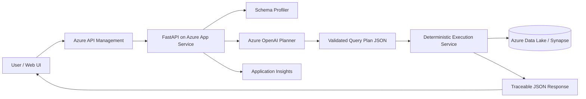
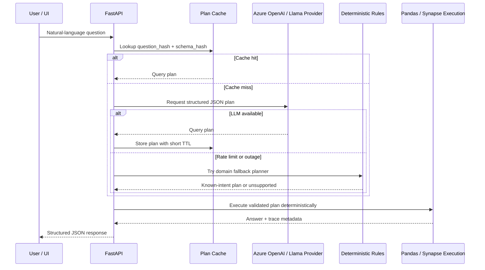

# Azure Production Architecture

This proof of concept should evolve into a small, governed analytics service where the LLM translates natural language into a constrained query plan, and deterministic compute performs every calculation.

## Request Flow

## Resilience Flow

## NL to Structured Operations

The API receives a natural-language question and the active dataset profile. Azure OpenAI returns only a constrained JSON plan: metric, operation, filters, grouping, sort, and output mode. A validation layer then checks that every referenced column exists, repairs known domain phrases such as `maintenance -> status_code=505`, and blocks unsupported requests before execution.

## Deterministic vs LLM Boundary

The LLM is used for intent mapping and optional human-readable explanation. It never calculates values or generates executable code. Pandas in the POC, and a production compute layer such as Synapse Spark, Fabric, or Azure Functions with DataFrames for smaller workloads, applies filters and performs averages, sums, rankings, comparisons, and lookups. The response includes the answer plus trace metadata: filters applied, operation, rows considered, and columns used.

## Azure Services

- **Azure API Management**: authentication, throttling, request policies, and versioned API exposure.
- **Azure App Service or Container Apps**: hosts the FastAPI service with managed identity.
- **Azure OpenAI**: primary provider for structured planning and non-authoritative summaries.
- **Provider fallback to a Llama-family model**: used when the primary provider is rate-limited or unavailable. This can be self-hosted, Azure-hosted, or another managed endpoint with the same JSON-plan contract.
- **Azure Data Lake Storage Gen2**: stores uploaded CSVs and curated datasets.
- **Azure Synapse or Microsoft Fabric**: production-scale deterministic analytics over larger datasets.
- **Azure Cache for Redis**: caches schema profiles and query plans by `question_hash + schema_hash` to reduce latency and LLM token spend.
- **Azure Key Vault**: stores model keys, database credentials, and signing secrets.
- **Application Insights + Log Analytics**: traces latency, planner failures, validation rejections, token usage, and calculation errors.

## Accuracy Assurance

Accuracy is protected by schema validation, deterministic execution, and regression tests for assessment-critical questions. Production should add golden query tests, sampled human review of planner output, plan/result logging, and a replay harness so any model or prompt change can be tested against historical questions before release.

## Failure Handling

If the planner produces an invalid column or unsupported metric, the API returns a structured unsupported response with available columns and suggested alternatives. If Azure OpenAI is unavailable, deterministic answers still return when a valid plan already exists; optional narrative enrichment is skipped. Empty result sets include the applied filters so users can understand whether the issue is filtering, missing columns, or missing data.

For known operational intents such as average load by region, March date filters, peak generation with companion load, maintenance hours, solar business-vs-off-peak comparison, and net balance, a deterministic fallback planner can construct a safe query plan without calling an LLM. Unknown questions fail closed with a clear unsupported response rather than a fabricated answer.

## Security, Monitoring, and Cost

Use Microsoft Entra ID for user auth and managed identities for service-to-service access. Store secrets in Key Vault, encrypt data at rest in ADLS, and apply row or workspace-level authorization before query execution. Monitor model token usage, latency, validation-failure rates, empty-result rates, and top query patterns. Control cost with prompt size limits, schema summarization, caching dataset profiles, rate limits in API Management, and routing simple follow-up explanations to deterministic templates when possible.

## Availability Targets

- **RTO**: 15 minutes for the API tier; failed instances restart behind App Service or Container Apps health probes.
- **RPO**: 0 for uploaded source files stored in ADLS; in-memory sessions and caches are best-effort POC state and should move to Redis/Cosmos DB for production durability.
- **LLM outage mode**: cached plans and deterministic fallback rules continue serving known intents. Open-ended questions return a structured degraded-mode message.

## Cost Controls

The planner prompt is capped and uses a compact schema profile. Successful plans are cached for repeated questions, and deterministic fallback avoids LLM calls for common operational questions. At production scale, log prompt/completion tokens per request and route simple intent classes to a cheaper Llama-family model while reserving Azure OpenAI for ambiguous or high-value questions.
