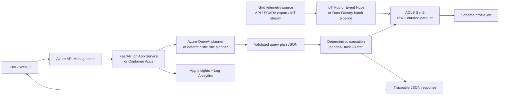
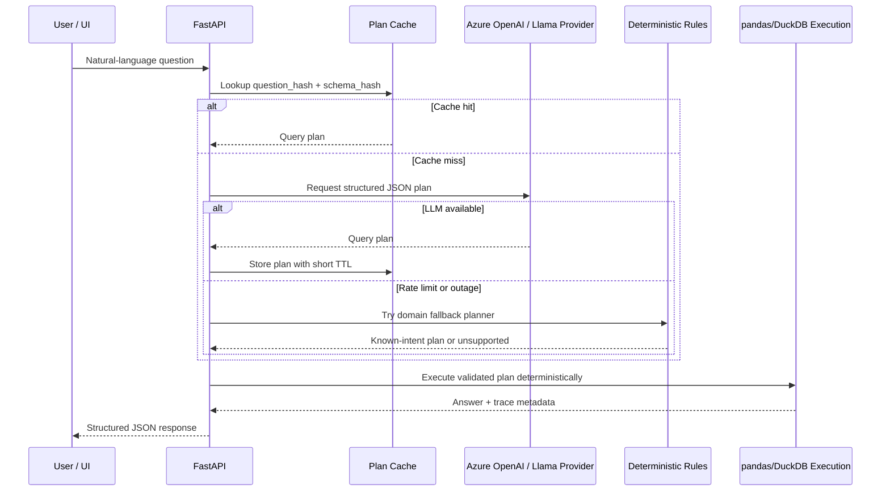

# Azure Production Architecture

This proof of concept should evolve into a small, governed analytics service where the LLM translates natural language into a constrained query plan, and deterministic compute performs every calculation.

The right-sized production design should start modestly. The supplied data is hourly smart-grid telemetry, so the default target is **ADLS + App Service/Container Apps + pandas or DuckDB**. Synapse, Fabric, or ADX become appropriate only after real scale signals appear, such as datasets above roughly 10 GB, multiple concurrent analyst workloads, joins across many operational systems, or sub-second dashboard serving requirements.

## Request Flow

## Data Ingestion and Governance

The POC upload endpoint is useful for assessment review, but a real smart-grid system should not rely on manual CSV uploads. For hourly telemetry, the first production path should be:

1. **Source ingestion**: use Azure Data Factory for scheduled exports from an operational system, or IoT Hub/Event Hubs if readings arrive as device or grid events.
2. **Landing zone**: write immutable raw files to ADLS Gen2 partitioned by `source`, `region`, `asset_id`, and date.
3. **Curated zone**: validate schema, normalize timestamps, enforce expected units, and write parquet files for query execution.
4. **Dataset registry**: maintain dataset metadata: owner, allowed regions/assets, schema version, freshness SLA, retention policy, and approved business glossary terms such as `maintenance = status_code 505`.
5. **Profile cache**: store schema profiles and allowed values so the planner sees compact metadata instead of full data samples.

## Resilience Flow

## NL to Structured Operations

The API receives a natural-language question and the active dataset profile. Azure OpenAI returns only a constrained JSON plan: metric, operation, filters, grouping, sort, and output mode. A validation layer then checks that every referenced column exists, repairs known domain phrases such as `maintenance -> status_code=505`, and blocks unsupported requests before execution.

## Deterministic vs LLM Boundary

The LLM is used for intent mapping and optional human-readable explanation. It never calculates values or generates executable code. Pandas in the POC, and DuckDB or pandas in the first production version, applies filters and performs averages, sums, rankings, comparisons, and lookups. The response includes the answer plus trace metadata: filters applied, operation, rows considered, and columns used.

Escalate the execution tier only when the workload demands it:

| Scale condition | Suggested execution layer |
|---|---|
| Up to a few GB, low concurrency, operational Q&A | App Service/Container Apps with pandas or DuckDB over parquet in ADLS |
| 10 GB+ datasets, multi-table joins, scheduled enterprise reporting | Microsoft Fabric Warehouse or Synapse Serverless SQL |
| High-frequency time-series queries, many concurrent users, low-latency dashboards | Azure Data Explorer |
| Heavy feature engineering or model training over telemetry history | Fabric/Synapse Spark |

## POC to Azure Component Map

| Current component | Production Azure target | Rationale |
|---|---|---|
| `web/` Next.js UI | Azure Static Web Apps or Azure App Service | Lightweight reviewer/user interface with simple CI/CD and optional Entra ID integration. |
| `backend/main.py` FastAPI routes | Azure App Service or Azure Container Apps behind API Management | Keeps the current REST contract while adding auth, throttling, health probes, and versioned API exposure. |
| `query_planner.py` | Azure OpenAI-backed planner service with deterministic rule pre-router | Preserves the strict NL-to-JSON contract and avoids LLM calls for known operational intents. |
| `filter_validator.py` and `validator.py` | Validation middleware inside the API service | Enforces schema safety, domain mappings, and fail-closed behavior before execution. |
| `execution_engine.py` | pandas/DuckDB first; Synapse/Fabric/ADX only after scale thresholds | Keeps calculations deterministic and avoids oversized big-data services for small hourly telemetry. |
| `schema_profiler.py` | Metadata profiling job stored in ADLS/Fabric catalog | Reuses schema-aware planning while caching dataset profiles for lower latency and token spend. |
| `response_builder.py` | API response contract layer | Maintains traceable JSON with formulas, filters, rows, and columns for auditability. |
| `enrichment_engine.py` | Optional Azure OpenAI narrative service | Adds human-readable summaries without changing deterministic values. |
| `session_store.py` and in-memory plan cache | Azure Cache for Redis or Cosmos DB | Makes sessions, cached plans, and repeated-question performance durable across instances. |
| `data/active_dataset.csv` | ADLS Gen2 raw/curated zones populated by Data Factory, IoT Hub, or Event Hubs | Moves uploaded source data out of local disk and gives production a real ingestion path. |
| `.env` secrets | Azure Key Vault with managed identity | Removes local secret handling from production runtime. |
| `backend/tests/` | CI regression and replay suite in GitHub Actions or Azure DevOps | Blocks prompt/model/code changes that break golden business questions. |

## Azure Services

- **Azure API Management**: authentication, throttling, request policies, and versioned API exposure.
- **Azure App Service or Container Apps**: hosts the FastAPI service with managed identity.
- **Azure OpenAI**: primary provider for structured planning and non-authoritative summaries.
- **Provider fallback to a Llama-family model**: used when the primary provider is rate-limited or unavailable. This can be self-hosted, Azure-hosted, or another managed endpoint with the same JSON-plan contract.
- **IoT Hub or Event Hubs**: stream grid telemetry when readings arrive from devices or operational event feeds.
- **Azure Data Factory or Fabric Data Pipelines**: batch ingestion from source systems, scheduled exports, and data quality checks.
- **Azure Data Lake Storage Gen2**: stores raw and curated telemetry in governed partitions.
- **pandas or DuckDB in the API worker**: default deterministic compute for small-to-medium data volumes.
- **Azure Synapse, Microsoft Fabric, or Azure Data Explorer**: scale-out analytics only when data volume, concurrency, or latency requirements justify it.
- **Azure Cache for Redis**: caches schema profiles and query plans by `question_hash + schema_hash` to reduce latency and LLM token spend.
- **Azure Key Vault**: stores model keys, database credentials, and signing secrets.
- **Application Insights + Log Analytics**: traces latency, planner failures, validation rejections, token usage, and calculation errors.

## Accuracy Assurance and Evaluation

Accuracy is protected by schema validation, deterministic execution, and regression tests for assessment-critical questions. Production should treat the planner like a model with release gates, not just a prompt.

The evaluation loop should include:

- **Golden query suite**: a versioned set of natural-language questions with expected query plans and pandas/DuckDB ground truth. The four assessment questions become seed tests.
- **Plan diffing**: for every prompt, model, or glossary change, compare old and new JSON plans before comparing final answers.
- **Release threshold**: require 100% pass on critical business questions and at least 95% pass on broader regression questions before promotion.
- **Canary rollout**: send 5-10% of planner traffic to a new prompt/model, execute in shadow mode, and compare plan validity, answer deltas, validation rejection rate, latency, and token cost before full rollout.
- **Production monitoring**: log rejected plans, unsupported metrics, empty-result rates, planner fallback usage, and human thumbs-up/down feedback for retraining the eval set.

## Failure Handling

If the planner produces an invalid column or unsupported metric, the API returns a structured unsupported response with available columns and suggested alternatives. If Azure OpenAI is unavailable, deterministic answers still return when a valid plan already exists; optional narrative enrichment is skipped. Empty result sets include the applied filters so users can understand whether the issue is filtering, missing columns, or missing data.

For known operational intents such as average load by region, March date filters, peak generation with companion load, maintenance hours, solar business-vs-off-peak comparison, and net balance, a deterministic fallback planner can construct a safe query plan without calling an LLM. Unknown questions fail closed with a clear unsupported response rather than a fabricated answer.

## Security, Authorization, and Prompt Safety

Use Microsoft Entra ID for user auth and managed identities for service-to-service access. Store secrets in Key Vault and encrypt data at rest in ADLS.

This system also needs domain-specific controls:

- **Region/asset authorization**: attach user claims such as allowed regions, assets, or business units. The API must inject these filters after planning and before execution, so a North_District operator cannot query Central_Hub data even if they ask for it.
- **Dataset governance**: only registered datasets with approved schema contracts should be queryable in production. Ad-hoc upload can remain an admin-only or sandbox feature.
- **Prompt-injection handling**: treat the user question as untrusted data. The planner system prompt must reject instructions to reveal secrets, bypass filters, ignore schema validation, or change authorization. The validator remains the final authority.
- **Log privacy**: store query text, plans, and metrics for debugging, but redact secrets and review whether asset IDs, locations, or operator notes are sensitive. Apply retention limits to prompt/response logs.

## Monitoring, Targets, and Cost

Initial production targets should be explicit:

| Metric | Initial target | Notes |
|---|---:|---|
| API p50 latency for deterministic-rule questions | < 800 ms | No LLM call; cached schema/profile. |
| API p95 latency for LLM-planned questions | < 4 s | Excludes first-time cold start and large dataset profile refresh. |
| Planner token budget | <= 1,500 input + 500 output tokens | Compact schema profile, no raw dataset rows except tiny samples. |
| Availability | 99.5% for POC production pilot | App Service/Container Apps health probes and one-region deployment. |
| API throughput | 1-5 QPS initially | Enough for assessment/pilot; scale horizontally after measuring real use. |
| Cost control | Cache hit rate > 30% on repeated questions | Cache plans by question hash + schema hash; skip LLM for known intents. |

Monitor model token usage, latency, validation-failure rates, empty-result rates, top query patterns, and authorization denials. Control cost with prompt size limits, schema summarization, caching dataset profiles, API Management rate limits, deterministic planning for common intents, and cheaper model routing for non-critical narrative summaries.

## Availability Targets

- **RTO**: 15 minutes for the API tier; failed instances restart behind App Service or Container Apps health probes.
- **RPO**: 0 for uploaded source files stored in ADLS; in-memory sessions and caches are best-effort POC state and should move to Redis/Cosmos DB for production durability.
- **LLM outage mode**: cached plans and deterministic fallback rules continue serving known intents. Open-ended questions return a structured degraded-mode message.

## Cost Controls

The planner prompt is capped and uses a compact schema profile. Successful plans are cached for repeated questions, and deterministic planning avoids LLM calls for common operational questions. At production scale, log prompt/completion tokens per request, set per-user/day quotas in API Management, and route simple narrative enrichment to a cheaper Llama-family model while reserving Azure OpenAI for ambiguous or high-value questions.
