# Interview Architecture Diagram

This diagram explains the application in the same sequence a user request follows. It is designed for an interview walkthrough: simple enough to explain quickly, but detailed enough to show the intelligence, checks, and guardrails behind every answer.

```mermaid
flowchart TD
    %% ============ USER + UI LAYER ============
    U([User types question<br/>in Next.js UI])
    U --> API[/"POST /ask<br/>FastAPI endpoint"/]

    %% ============ LAYER 1: SESSION & CONTEXT ============
    API --> S1[session_store.py<br/>In-memory session<br/>20 turns / 2h TTL]
    S1 --> S2[context_resolver.py<br/>Is this a follow-up?<br/>5 modes: new / follow_up /<br/>refinement / comparison / explanation]
    S2 -->|carries metric, filters,<br/>time_range if follow-up| P0

    %% ============ LAYER 2: PLANNER LADDER ============
    P0{query_planner.py<br/>Plan generation}
    P0 -->|Pattern match<br/>known intent| R1[Rule-based Plan<br/>NO LLM CALL]
    P0 -->|Same question asked<br/>recently| R2[Cached Plan<br/>NO LLM CALL]
    P0 -->|Open-ended question| R3[llm_parser.py<br/>Groq Llama 3.3 70B<br/>JSON mode enforced<br/>Schema in prompt]

    R1 --> V1
    R2 --> V1
    R3 --> V1

    %% ============ LAYER 3: VALIDATION ============
    V1[filter_validator.py<br/>Fuzzy match filter values<br/>0.8 similarity cutoff]
    V1 -->|filter auto-corrected<br/>logged in _filter_corrections| V2
    V1 -->|filter removed entirely<br/>cannot match any value| ABORT[Abort with empty result<br/>Won't silently drop user intent]

    V2[apply_semantic_mappings<br/>Deterministic overrides<br/>maintenance to status_code 505<br/>solar to SOLAR asset IDs<br/>business hours 07-10 and 17-20<br/>week 2 of March to 03-07 to 03-14]
    V2 --> V3

    V3[validator.py<br/>Does metric column exist?]
    V3 -->|column missing<br/>e.g. curtailment_flag| UNSUP[unsupported response<br/>Returns available columns<br/>Never fabricates answer]
    V3 -->|plan valid| EXEC

    %% ============ LAYER 4: EXECUTION ============
    EXEC[execution_engine.py<br/>pandas runs the plan<br/>aggregate / rank / compare /<br/>peak / net_balance / split_compare]
    EXEC --> CORE

    %% ============ LAYER 5: CORE RESPONSE ============
    CORE[response_builder.py<br/>Build deterministic answer<br/>primary_value + unit<br/>filters + operation<br/>rows_considered<br/>calculation_steps<br/>formula_with_values]
    CORE --> CHART[chart_engine.py<br/>Build Plotly spec<br/>deterministic, no LLM]
    CHART --> ENR

    %% ============ LAYER 6: OPTIONAL ENRICHMENT ============
    ENR{enrichment_engine.py<br/>LLM narrative?<br/>additive only}
    ENR -->|skip if empty result,<br/>rule-based, or cache hit| RESP
    ENR -->|call Groq for<br/>summary + insights + KPIs| ENRICH[LLM writes narrative only<br/>Numbers never change]
    ENRICH -->|on failure: keep core<br/>never crash| RESP
    ENRICH --> RESP

    %% ============ RESPONSE ============
    RESP[JSON Response<br/>answer + trace + chart +<br/>verification + query_plan +<br/>session_id]
    RESP --> UPDATE[session_store.update<br/>Save turn for next follow-up]
    UPDATE --> UI2([UI renders answer<br/>+ calculation trace<br/>+ Plotly chart])

    ABORT --> RESP
    UNSUP --> RESP

    %% ============ STYLING ============
    classDef guardrail fill:#fff3cd,stroke:#f0ad4e,stroke-width:2px,color:#000
    classDef noLLM fill:#d4edda,stroke:#28a745,stroke-width:2px,color:#000
    classDef llm fill:#cce5ff,stroke:#007bff,stroke-width:2px,color:#000
    classDef abort fill:#f8d7da,stroke:#dc3545,stroke-width:2px,color:#000

    class V1,V2,V3 guardrail
    class R1,R2,CORE,CHART,EXEC noLLM
    class R3,ENRICH llm
    class ABORT,UNSUP abort
```

## Colour Legend

| Colour | Meaning |
|---|---|
| Green | Deterministic — no LLM touches this |
| Yellow | Guardrail — actively filtering, correcting, or mapping |
| Blue | LLM is invoked here (constrained: JSON mode + schema in prompt) |
| Red | Fail-safe exit — refuses to fabricate an answer |

The visual story: most of the flow is green and yellow. The LLM (blue) is invoked in only two places, and both are sandwiched between guardrails. Red boxes are the refusal paths that prevent hallucinated answers.

## Simple Interview Talk Track (top to bottom)

1. **User layer** — A user types a question in the Next.js UI. It hits `POST /ask` on the FastAPI backend.
2. **Session layer** — The session store (20 turns, 2-hour TTL) provides context. The context resolver decides if the new question is brand new or a follow-up, and carries forward metric/filters/time-range when appropriate. This is what makes the tool conversational.
3. **Planner ladder** — The system tries a deterministic rule-based plan first (no LLM call). If that misses, it checks the plan cache. Only if both miss does it call the LLM, and even then it forces JSON output and sends the full schema in the prompt.
4. **Validation layer** — The filter validator fuzzy-matches values with a strict 0.8 similarity cutoff; if a filter cannot be matched at all, the request aborts rather than silently drop it. Semantic mappings override critical phrases (maintenance always equals `status_code == 505`, week 2 of March always equals 2026-03-07 to 2026-03-14). The metric validator rejects non-existent columns and returns a structured unsupported response.
5. **Execution layer** — Pandas runs the validated plan. All math is deterministic Python.
6. **Core response** — The response builder returns the answer, the filters applied, the operation, the rows considered, the calculation steps, and the formula with values substituted. Everything is traceable.
7. **Optional enrichment** — An LLM narrative layer adds a summary and insights, but only when safe (skipped on empty results, rule-based plans, and cache hits). If this layer fails, the core response still returns intact.
8. **Session update** — The turn is saved so the next follow-up can build on it.

## Core Intelligence (the six built-in guardrails)

1. **Rule-first planning** — The 4 assessment questions never touch the LLM.
2. **Plan caching** — Identical question + schema returns the identical plan.
3. **JSON-mode LLM** — The LLM is physically constrained to emit valid JSON.
4. **Fuzzy filter validation** — 0.8 cutoff, abort rather than silently drop a user filter.
5. **Semantic overrides** — Assessment-critical phrases are deterministically mapped.
6. **Metric validation + traceability** — Missing columns return a structured unsupported response; every answer carries a verification block so drift is visible, not hidden.

## The One-Liner for the Interview

> *"Count the boxes. Most of the system is green and deterministic. The LLM shows up in only two places, and both are sandwiched between yellow guardrails. Red boxes are the refusal paths — the system never fabricates an answer, it fails closed with a clear explanation. That is why every number is accurate, traceable, and reproducible."*
